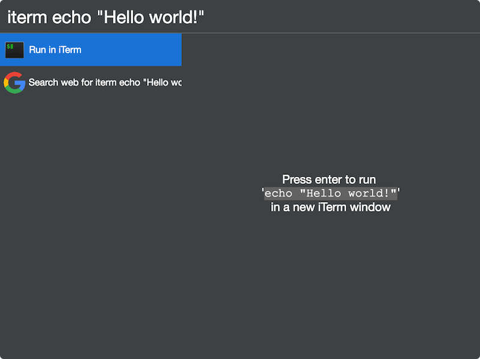

# cerebro-iterm

> [Cerebro](http://www.cerebroapp.com) plugin to execute any shell command from Cerebro search line in iTerm

## Usage

In Cerebro, type `iterm ` + your shell command. This command will be executed from the directory of the default iTerm profile.

## Features

* Uses your iTerm configuration
## Related

- [Cerebro](http://github.com/KELiON/cerebro) – main repo for Cerebro app;

## License

MIT © [Josiah Nunemaker](http://fracturedloop.github.io)